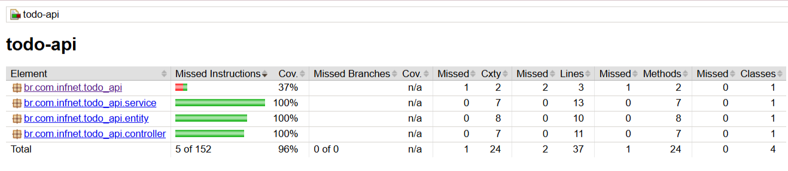

# Fullstack ToDo App — React + Spring Boot

Aplicação full stack para gerenciamento de tarefas (ToDo List), desenvolvida com **React** no frontend e **Spring Boot** no backend.  
O projeto implementa um CRUD completo com interface web, com testes automatizados avançados e técnicas robustas de validação, simulação de falhas e fuzz testing.

## Tecnologias Utilizadas

### Frontend

- React
- Vite
- Tailwind CSS
- Material UI (MUI)

### Backend

- Java 17
- Spring Boot
- Spring Web
- Spring Data JPA
- Banco H2

### Testes

- JUnit 5
- Mockito
- Selenium WebDriver
- WebDriverManager

## Funcionalidades

- Cadastro de tarefas
- Listagem de tarefas
- Edição de tarefas
- Exclusão de tarefas
- Alteração de status (A Fazer / Concluído)
- Feedback visual com mensagens de sucesso e erro
- Interface responsiva e intuitiva


## Como Executar o Projeto

### Backend

```bash
cd backend/todo-api
mvn spring-boot:run
```

_API disponível em:_
`http://localhost:8080`

### Frontend

```bash
cd frontend/todo-web
npm install
npm run dev
```

_Aplicação web disponível em:_
`http://localhost:5173`

## Como Executar Testes

### Testes unitários

```bash
mvn test
```

### Testes E2E com Selenium

```bash
mvn test -Dtest=*Selenium*
```

---

## Relatório de cobertura de código com JaCoCo


